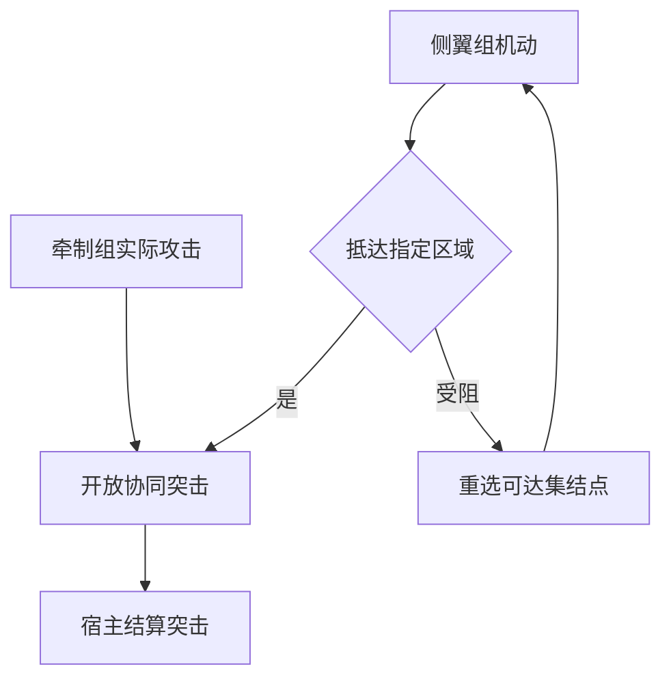

# 可扩展任务规划与游戏机制适配

## 接入原则

基础 `BattleAdapter` 方法保持兼容。游戏只提供自身已有的合法动作；框架的预测不会修改宿主事实。旧接入器可以省略新增能力声明，使用基础方案继续运行。

宿主可在 `Observation` 中声明：

```ts
capabilities: {
  mechanisms: {
    movement: true,
    'ranged-fire': true,
    ammo: false,
    terrain: true,
    flanking: true,
    recon: false,
    smoke: false,
    suppression: false,
    stealth: false,
  },
  actionKinds: { move: ['walk'], attack: ['strike'], defend: ['guard'] },
  fullyObservable: false,
}
```

机制 ID 与动作映射键都是开放字符串，不需要修改核心枚举。`actionKinds` 把框架语义映射到宿主实际动作种类；最终提交仍使用宿主返回的原始动作。能力声明仅用于规划，不能代替 `legalActions` 的许可。

| 缺少的机制         | 默认处理                                                                         |
| ------------------ | -------------------------------------------------------------------------------- |
| 移动／路径         | 不采用必须机动的方案；保留当前可执行的战斗或防御动作                             |
| 烟幕、压制、隐蔽   | 跳过相关可选辅助战法；不采用以其为必要条件的渗透、伏击等方案                     |
| 弹药               | `ammo:false` 时规划器不把数值占位的 0 当成弹药耗尽，合法性由宿主决定             |
| 侦察动作           | 不生成虚构侦察命令；可使用符合条件的试探或警戒方案                               |
| 方格坐标／侧翼语义 | 使用区域邻接图；不声明 `flanking` 时不强行套用左右包围                           |
| 迷雾／视野         | 无需提供相关模块；只有明确 `fullyObservable:true` 才把观察中无敌军视作已知无敌军 |
| 士气、补给、建造   | 都不是核心启动依赖，可作为新机制、操作和战法注册                                 |

不声明能力时，仅从基础地图邻接和射程保守推断移动、远程火力；其他高级机制默认不可用。显式 `false` 优先于推断。能力推断本身可用 `capabilityResolver` 替换。

## 每个环节的扩展入口

| 环节                                     | 接口或注册表                                                                |
| ---------------------------------------- | --------------------------------------------------------------------------- |
| 游戏观察、合法动作、结算、快照           | `BattleAdapter`                                                             |
| 目标输入                                 | `GoalSource`、`NarrativeSource`、`TextExtractor`；目标 kind 可使用自定义 ID |
| 机制识别与动作别名                       | `CapabilityResolver`                                                        |
| 战术分类                                 | `Registry<TacticCategory>`                                                  |
| 战术模板及参数                           | `DoctrineRegistry` / `TaskMethod.decompose`                                 |
| 辅助战法                                 | `Registry<TacticalModifier>`                                                |
| 复合任务及替代分解                       | `Registry<HtnMethod>`                                                       |
| 基础操作、条件、预测、执行评分、局部修复 | `Registry<TaskOperator>`                                                    |
| 整体规划算法                             | `TaskPlanner`                                                               |
| 执行与无进展处理                         | `TaskExecutor` / `ExecutionPolicy`                                          |
| 态势、流程步骤                           | `DecisionStage` / `Workflow`                                                |
| 分工、冲突协调、评价与选择               | `Allocator`、`Coordinator`、`Evaluator`、`Selector`                         |
| 能力、风格、模型、保存                   | profiles、`StyleDimensionRegistry`、`DecisionProvider`、`PlanStore`         |

注册表支持 `register` 新模块与 `replace` 同 ID 模块。替代规划器／执行器也必须遵守任务归属、依赖和宿主合法动作契约。JSON 保存参数，函数实现通过 TypeScript 注入。见 [可编译的扩展示例](../examples/task-network.ts)。

## 任务网络与预测

`TaskSpec` 包含任务 ID、操作或复合任务名、参与单位、前置任务列表和可选参数。复合任务通过 `HtnMethod` 分解，直到得到 `TaskOperator`。

默认规划器具有有限预算、前置条件、预测效果、替代方法回溯和依赖循环检查。平行分支只能读取其祖先任务的预测效果。预测全部保存在独立的 `facts` 中，不能改变 Observation。



战术偏好在可行模板中生效，不能将明确的撤退目标改为进攻。

任务分类树与执行依赖网是不同结构。上级／下级指挥节点保留唯一单位归属；每个指挥官的战术展开为可执行任务网。此实现没有承诺自动求解任意规模的多军团战略分工。

`TaskOperator.canPlan` 检查规划可行性；`predict` 返回预期效果；`canExecute` 可追加运行期条件；`observe` 确认实际成功／失败／继续；`score` 只从宿主合法动作中选择；`repair` 可改变受阻步骤的参数。预测条件通过不等于实际动作已经完成。

当前使用有预算的分解搜索和依赖执行，没有完整敌方博弈树。能力档位不裁剪必要步骤；复杂域耗尽分解预算后，选择另一个可行方案。

## 单位、通路与局部修复

准备执行的步骤按确定顺序取得单位及显式 `resources` 预留。两个步骤共享资源时，后者等待前者完成。资源名可表示通路、桥梁、支援火力等，由接入方定义；这不替代宿主的实时碰撞与路径判断。

移动无进展默认 3 个宿主逻辑回合后尝试修复，最多 2 次。修复保留其他分支及其完成结果，并生成修订记录。失败后会排除已失败战法并尝试其他方案。有意固守／等待可以关闭操作自己的 watchdog。

`turn` 应表示适合该游戏的逻辑节拍；实时游戏应配置合理阈值或替换执行器，不要把默认 3 当作 3 帧或 3 秒。

## 异步动作

即时结算游戏继续返回原有回执即可。对于“命令已经接受，移动尚未结束”的宿主：

1. `ActionReceipt` 返回 `applied:true, execution:'running'`，持久化完整回执。
2. `Observation.orders[动作唯一键]` 提供 `running`、`succeeded` 或 `failed`。
3. 框架保存未完成订单，恢复后继续等待，不向仍忙碌的单位重复发令。
4. 只有成功状态才能累计该操作的完成动作数并解锁依赖。

宿主拒绝提交时，控制器等待战况更新，并记住该状态版本中被拒绝的动作，防止重复提交。

宿主须持续提供可查询的终态；取消、被替换或失败的订单也要报告终态。暂停会停止新提交，不撤销宿主已经接受的不可拆分动作。手动接管仍由宿主决定如何替换已有命令。

## 模型调用与延迟

默认 `modelActionMode:'local'`：Jev 参与需要重新选择的战术方案，普通执行动作在本地处理。有效计划持续复用。分类层级不产生额外模型调用。

`maxModelCallsPerDecision` 默认 2，限制整个 `step()` 的模型请求总数；超出后使用本地选择。同一请求批量评价候选，必要的请求受决策总预算限制。设为 0 可完全关闭在线决策；设 `modelActionMode:'model'` 可让动作选择也参与竞争这份请求预算。

没有模型密钥仍可完整运行。真实服务的延迟和模型质量需要用实际密钥评测；测试验证了协议、调用数量与本地降级。

## 保存与升级

任务网、每步状态、预测／执行事实、局部修复次数、运行中订单均进入检查点。原格式的计划会在安全决策边界迁移；已有待提交动作先按旧的唯一键核实。自定义域恢复时必须重新注册其使用的模块。

设计参考：[SHOP2](https://www.cs.umd.edu/~nau/papers/nau2003shop2.pdf)、[Fluid HTN](https://github.com/ptrefall/fluid-hierarchical-task-network)、[OpenRA 小队执行](https://github.com/OpenRA/OpenRA/blob/f3ec7f8e1593b482f85fd101652deb740c33dee6/OpenRA.Mods.Common/Traits/BotModules/Squads/States/GroundStates.cs)。本仓库使用独立 TypeScript 实现。
